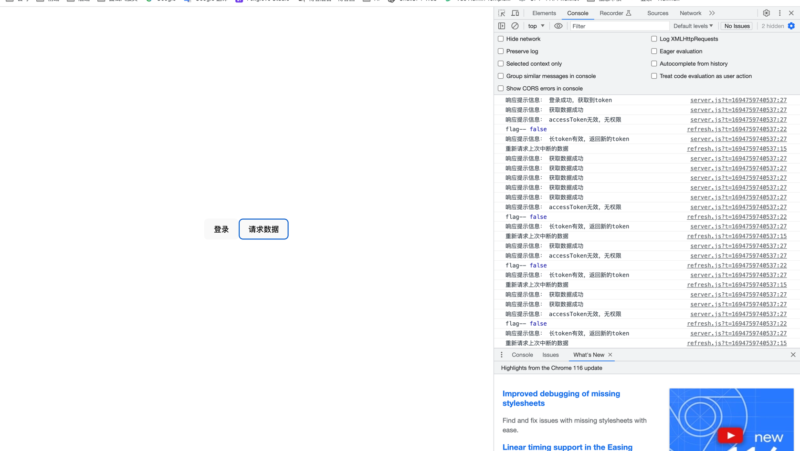

## 1、前言
想象下，你正常在网页上浏览页面。突然弹出一个窗口，告诉你登录失效，跳回了登录页面，让你重新登录。你是不是很恼火。这时候<span style="background-color: yellow;">无感登录</span>的作用就体现出来了。

## 2、方案
### 2.1 redis设置过期时间
在最新的技术当中，token一般都是在<span style="background-color: yellow;">Redis</span>服务器存着，设置过期时间。只要在有效时间内，重新发出请求，Redis中的过期时间会去更新，这样前只需要一个token。这个方案一般是后端做。

### 2.2 双token模式
#### 2.21 原理
* 用户登录向服务端发送账号密码，登录失败返回客户端重新登录。登录成功服务端生成 accessToken 和 refreshToken，返回生成的 token 给客户端。
* 在请求拦截器中，请求头中携带 accessToken 请求数据，服务端验证 accessToken 是否过期。token 有效继续请求数据，token 失效返回失效信息到客户端。
* 客户端收到服务端发送的请求信息，在二次封装的 axios 的响应拦截器中判断是否有 accessToken 失效的信息，没有返回响应的数据。有失效的信息，就携带 refreshToken 请求新的 accessToken。
* 服务端验证 refreshToken 是否有效。有效，重新生成 token， 返回新的 token 和提示信息到客户端，无效，返回无效信息给客户端。
* 客户端响应拦截器判断响应信息是否有 refreshToken 有效无效。无效，退出当前登录。有效，重新存储新的 token，继续请求上一次请求的数据。

#### 2.22 上代码
后端：node.js、koa2服务器、jwt、koa-cors等(可使用koa脚手架创建项目,本项目基于koa脚手架创建。完整代码可见文章末尾github地址)
1. 新建utils/token.js （双token）
```javascript
const jwt=require('jsonwebtoken')

const secret='2023F_Ycb/wp_sd'  // 密钥
/*
expiresIn:5 过期时间，时间单位是秒
也可以这么写 expiresIn:1d 代表一天
1h 代表一小时
*/
// 本次是为了测试，所以设置时间 短token5秒 长token15秒
const accessTokenTime=5
const refreshTokenTime=15

// 生成accessToken
const accessToken=(payload={})=>{  // payload 携带用户信息
    return jwt.sign(payload,secret,{expiresIn:accessTokenTime})
}
//生成refreshToken
const refreshToken=(payload={})=>{
    return jwt.sign(payload,secret,{expiresIn:refreshTokenTime})
}

module.exports={
    secret,
    accessToken,
    refreshToken
}
```

2. router/index.js 创建路由接口
```javascript
const router = require('koa-router')()
const jwt = require('jsonwebtoken')
const { accessToken, refreshToken, secret }=require('../utils/token')
router.get('/', async (ctx, next) => {
  await ctx.render('index', {
    title: 'Hello Koa 2!'
  })
})

router.get('/string', async (ctx, next) => {
  ctx.body = 'koa2 string'
})

router.get('/json', async (ctx, next) => {
  ctx.body = {
    title: 'koa2 json'
  }
})
/*登录接口*/
router.get('/login',(ctx)=>{
  let code,msg,data=null
  code=2000
  msg='登录成功，获取到token'
  data={
    accessToken:accessToken(),
    refreshToken:refreshToken()
  }
  ctx.body={
    code,
    msg,
    data
  }
})

/*用于测试的获取数据接口*/
router.get('/getTestData',(ctx)=>{
  let code,msg,data=null
  code=2000
  msg='获取数据成功'
  ctx.body={
    code,
    msg,
    data
  }
})

/*验证长token是否有效，刷新短token
  这里要注意，在刷新短token的时候回也返回新的长token，延续长token，
  这样活跃用户在持续操作过程中不会被迫退出登录。长时间无操作的非活
  跃用户长token过期重新登录
*/
router.get('/refresh',(ctx)=>{

  let code,msg,data=null
  //获取请求头中携带的长token
  let r_tk=ctx.request.headers['pass']
  //解析token 参数 token 密钥 回调函数返回信息
  jwt.verify(r_tk,secret,(error)=>{
    if(error){
      code=4006,
      msg='长token无效，请重新登录'
    }
    else{
      code = 2000,
      msg = '长token有效，返回新的token'
      data = {
        accessToken: accessToken(),
        refreshToken: refreshToken()
      }
    }
    ctx.body={
      code,
      msg:msg?msg:null,
      data
    }
  })
})


module.exports = router
```
3.新建utils/auth.js (中间件)
```javascript
const { secret } = require('./token')
const jwt = require('jsonwebtoken')

/*白名单，登录、刷新短token不受限制，也就不用token验证*/
const whiteList=['/login','/refresh']
const isWhiteList=(url,whiteList)=>{
    return whiteList.find(item => item === url) ? true : false
}

/*中间件
 验证短token是否有效
*/
const auth = async (ctx,next)=>{
    let code, msg, data = null
    let url = ctx.path
    if(isWhiteList(url,whiteList)){
        // 执行下一步
        return await next()
    } else {
        // 获取请求头携带的短token
        const a_tk=ctx.request.headers['authorization']
        if(!a_tk){
            code=4003
            msg='accessToken无效，无权限'
            ctx.body={
                code,
                msg,
                data
            }
        } else{
            // 解析token
            await jwt.verify(a_tk,secret,async (error)=>{
                if(error){
                    code=4003
                    msg='accessToken无效，无权限'
                    ctx.body={
                        code,
                        msg,
                        data
                    }
                } else {
                    // token有效
                    return await next()
                }
            })
        }
    }
}
module.exports=auth
```
4. app.js
```javascript
const Koa = require('koa')
const app = new Koa()
const views = require('koa-views')
const json = require('koa-json')
const onerror = require('koa-onerror')
const bodyparser = require('koa-bodyparser')
const logger = require('koa-logger')
const cors=require('koa-cors')

const index = require('./routes/index')
const users = require('./routes/users')
const auth=require('./utils/auth')

// error handler
onerror(app)

// middlewares
app.use(bodyparser({
  enableTypes:['json', 'form', 'text']
}))
app.use(json())
app.use(logger())
app.use(require('koa-static')(__dirname + '/public'))
app.use(cors())
app.use(auth)

app.use(views(__dirname + '/views', {
  extension: 'pug'
}))

// logger
app.use(async (ctx, next) => {
  const start = new Date()
  await next()
  const ms = new Date() - start
  console.log(`${ctx.method} ${ctx.url} - ${ms}ms`)
})

// routes
app.use(index.routes(), index.allowedMethods())
app.use(users.routes(), users.allowedMethods())

// error-handling
app.on('error', (err, ctx) => {
  console.error('server error', err, ctx)
});

module.exports = app
```
前端:vite、vue3、axios等 (完整代码可见文章末尾github地址)
1. 新建config/constants.js
```javascript
export const ACCESS_TOKEN = 'a_tk' // 短token字段
export const REFRESH_TOKEN = 'r_tk' // 短token字段
export const AUTH = 'Authorization'  // header头部 携带短token
export const PASS = 'pass' // header头部 携带长token
```
2. 新建config/storage.js
```javascript
import * as constants from "./constants"

// 存储短token
export const setAccessToken = (token) => localStorage.setItem(constants.ACCESS_TOKEN, token)
// 存储长token
export const setRefreshToken = (token) => localStorage.setItem(constants.REFRESH_TOKEN, token)
// 获取短token
export const getAccessToken = () => localStorage.getItem(constants.ACCESS_TOKEN)
// 获取长token
export const getRefreshToken = () => localStorage.getItem(constants.REFRESH_TOKEN)
// 删除短token
export const removeAccessToken = () => localStorage.removeItem(constants.ACCESS_TOKEN)
// 删除长token
export const removeRefreshToken = () => localStorage.removeItem(constants.REFRESH_TOKEN)
```
3.新建utils/refresh.js
```javascript
export {REFRESH_TOKEN,PASS} from '../config/constants.js'
import { getRefreshToken, removeRefreshToken, setAccessToken, setRefreshToken} from '../config/storage'
import server from "./server";

let subscribes=[]
let flag=false // 设置开关，保证一次只能请求一次短token，防止客户多此操作，多次请求

/*把过期请求添加在数组中*/
export const addRequest = (request) => {
    subscribes.push(request)
}

/*调用过期请求*/
export const retryRequest = () => {
    console.log('重新请求上次中断的数据');
    subscribes.forEach(request => request())
    subscribes = []
}

/*短token过期，携带token去重新请求token*/
export const refreshToken=()=>{
    console.log('flag--',flag)
    if(!flag){
        flag = true;
        let r_tk = getRefreshToken() // 获取长token
        if(r_tk){
            server.get('/refresh',Object.assign({},{
                headers:{PASS : r_tk}
            })).then((res)=>{
                //长token失效，退出登录
                if(res.code===4006){
                    flag = false
                    removeRefreshToken(REFRESH_TOKEN)
                } else if(res.code===2000){
                    // 存储新的token
                    setAccessToken(res.data.accessToken)
                    setRefreshToken(res.data.refreshToken)
                    flag = false
                    // 重新请求数据
                    retryRequest()
                }
            })
        }
    }
}
```
4.新建utils/server.js
```javascript
import axios from "axios";
import * as storage from "../config/storage"
import * as constants from '../config/constants'
import { addRequest, refreshToken } from "./refresh";

const server = axios.create({
    baseURL: 'http://localhost:3000', // 你的服务器
    timeout: 1000 * 10,
    headers: {
        "Content-type": "application/json"
    }
})

/*请求拦截器*/
server.interceptors.request.use(config => {
    // 获取短token，携带到请求头，服务端校验
    let aToken = storage.getAccessToken(constants.ACCESS_TOKEN)
    config.headers[constants.AUTH] = aToken
    return config
})

/*响应拦截器*/
server.interceptors.response.use(
    async response => {
        // 获取到配置和后端响应的数据
        let { config, data } = response
        console.log('响应提示信息：', data.msg);
        return new Promise((resolve, reject) => {
            // 短token失效
            if (data.code === 4003) {
                // 移除失效的短token
                storage.removeAccessToken(constants.ACCESS_TOKEN)
                // 把过期请求存储起来，用于请求到新的短token，再次请求，达到无感刷新
                addRequest(() => resolve(server(config)))
                // 携带长token去请求新的token
                refreshToken()
            } else {
                // 有效返回相应的数据
                resolve(data)
            }

        })

    },
    error => {
        return Promise.reject(error)
    }
)
export default  server
```
5.新建apis/index.js
```javascript
import server from "../utils/server.js";
/*登录*/
export const login = () => {
    return server({
        url: '/login',
        method: 'get'
    })
}
/*请求数据*/
export const getList = () => {
    return server({
        url: '/getTestData',
        method: 'get'
    })
}
```
6.修改App.vue
```javascript
<script setup>
  import {login,getList} from "./apis";
  import {setAccessToken,setRefreshToken} from "./config/storage";
  const getToken=()=>{
    login().then(res=>{
      setAccessToken(res.data.accessToken)
      setRefreshToken(res.data.refreshToken)
    })
  }
  const getData = ()=>{
    getList()
  }
</script>

<template>
    <button @click="getToken">登录</button>
    <button @click="getData">请求数据</button>

</template>

<style scoped>
.logo {
  height: 6em;
  padding: 1.5em;
  will-change: filter;
  transition: filter 300ms;
}
.logo:hover {
  filter: drop-shadow(0 0 2em #646cffaa);
}
.logo.vue:hover {
  filter: drop-shadow(0 0 2em #42b883aa);
}
</style>
```
#### 2.23 效果图

## 3、完整项目代码
### 3.1 地址
[https://github.com/heyu3913/doubleToken](https://github.com/heyu3913/doubleToken)

### 3.2 运行
后端：
```javascript
cd server
pnpm i
pnpm start
```
前端
```javascript
cd my-vue-app
pnpm i
pnpm dev
```
大家可以愉快的玩耍咯
